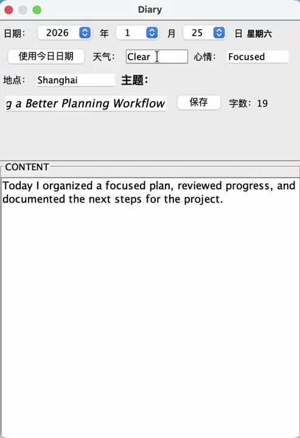

# DiaryBook

一个本地 Java 桌面日记本，支持用户账户、结构化日记信息、编辑、分页和按用户持久化。

[English](README.md)

## 项目概述

DiaryBook 提供完整的个人写作流程：注册或登录、创建指定日期的日记、填写天气、心情、地点和主题，并在保存后返回日记列表继续查看或编辑。

## 截图



截图直接来自运行中的桌面应用，使用一次性合成内容，不包含真实身份或口令。

## 功能

- 本地注册与登录
- 日期、天气、心情、地点、主题和正文
- 新建、编辑、删除与分页
- 本地导出
- 按用户序列化存储

## 架构

多个 Swing 窗口分别承担身份验证、日记编辑和日记浏览；用户与日记对象序列化保存到本地文件。

## 运行

仓库中的构建产物已在 Java 25 上验证：

```bash
java -jar DiaryBook.jar
```

## 隐私说明

日记内容和最近用户状态均为本地文件。请勿提交真实日记、口令、`LASTUSER` 或个人 `Users` 数据。
